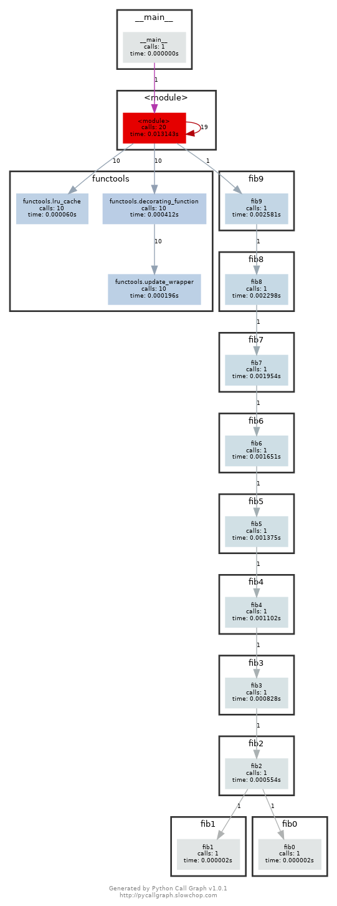

### Question 1
```bash
journalctl --since today | grep "sudo"
```

This command achieves the task on Ubuntu 22.04, please consult your OS
documentation and adapt if necessary.

### Question 3
After running `shellcheck` on the given script and making suggested fixes, here
is the final version:
```shell
#!/bin/sh

for f in  *.m3u
do 
    grep -qi "hq.*mp3" "$f" \
        && echo -e "Playlist $f contains a HQ file in mp3 format"
done
```

### Question 5
When compared using `perf`, differences between algorithms are small, however
insertion sort took more cpu cycles to complete. Regarding cache hits and
misses, it is relatively the same for all 3 algorithms. There is no noticeable
improvement between the in-place sorts, which theory suggests is more
memory-efficient.
```bash
perf stat -e cycles,cache-references,cache-misses -r 20 -- python3 sorts.py <algorithm>
```

### Question 6
Without memoization, `fib0` is called 21 times.


With memoization, `fib0` is only called 1 time.



### Question 7
One-liner:
```bash
lsof | grep -e "4444.*LISTEN" | awk '{print $2};' | xargs kill
```

### Question 8
`stress` will not take 3 CPUs since `taskset` fixes the CPU affinity of the
`stress` command, which now can only use CPU #0 and #2.

To achieve the same using `cgroups`:
```bash
sudo mkdir /sys/fs/cgroup/cpuset/missing-semester
echo "0, 2" | sudo tee /sys/fs/cgroup/cpuset/missing-semester/cpuset.cpus
echo "1" | sudo tee /sys/fs/cgroup/cpuset/missing-semester/cpuset.mems
echo "<pid of stress>" | sudo tee
/sys/fs/cgroup/cpuset/missing-semester/cpuset.procs
```
