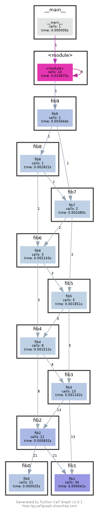

### Question 1
```bash
journalctl --since today | grep "sudo"
```

This command achieves the task on Ubuntu 22.04, please consult your OS
documentation and adapt if necessary.

### Question 3
After running `shellcheck` on the given script and making suggested fixes, here
is the final version:
```shell
#!/bin/sh

for f in  *.m3u
do 
    grep -qi "hq.*mp3" "$f" \
        && echo -e "Playlist $f contains a HQ file in mp3 format"
done
```

### Question 6
Without memoization, `fib0` is called 21 times.

